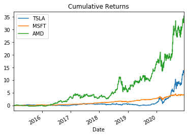
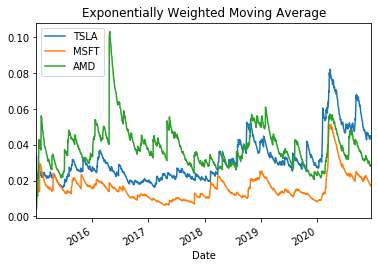
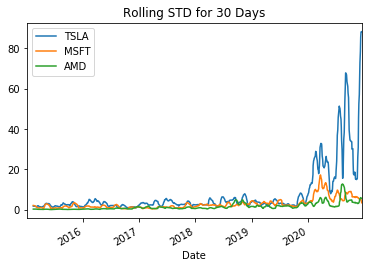
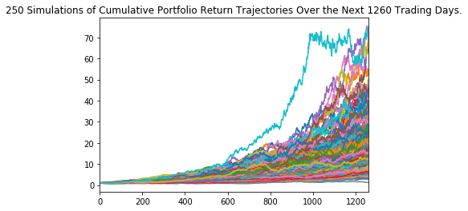

# FinEdu

This is an educational notebook designed to help newcomers approach algorithmic trading by helping users understand the models involved with making replicable decisions. We’ll show you how to become an informed trader in 10 minutes by providing the tools to visualize the market based on price changes, this will help you devise a strategy to trade a group of stocks and maximize expected returns.

In this educational notebook, you will learn about the subjects as below:

## Historical Analysis

Performance and Risk Analysis are helpful to understand how a stock performed within a time frame. 

#### ***Performance Analysis***

* **Daily Returns**
  
    
   
* **Cumulative Returns**

     

* **Exponentially Weighted Moving Average**

   

#### ***Risk Analysis***

* **Standard Deviation**

    

* **Sharpe Ratio**
  
    

* **Rolling Standard Deviation**

    

## Forecasting

Monte Carlo Simulation is one of the main analysis tool to forecast a stock's future moves. 

#### **Monte Carlo Simulation**

**Definition:** Computational algorithms that rely on repeated random sampling to obtain numerical results.

**Purpose:** The underlying concept is to use randomness to solve problems that might be deterministic in principle.

